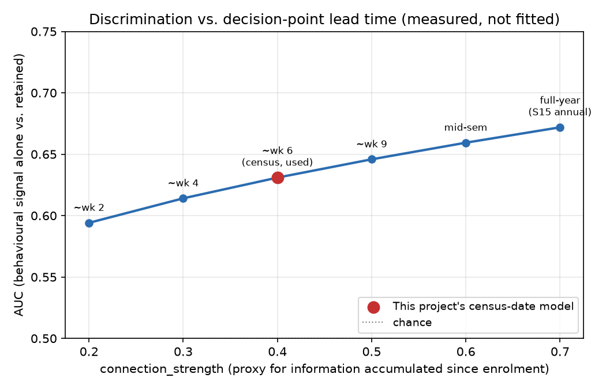

# Phase 4a -- Leakage-safe risk model design

## Purpose

Phase 3 built a calibrated synthetic cohort with real outcomes attached. This
document fixes, **before any model is fit**, the single decision that
determines whether Phase 4's risk model is measuring something real or
something the outcome-generating process handed it for free: what moment in
a student's year the model predicts from, and which columns are legitimately
known at that moment.

## Prediction point

**End of Semester 1 census date, predicting whether the student fails to
re-enrol for Year 2 (`retained = False`).**

This is the earliest point a real institution would plausibly want to act:
census date is when enrolment load is locked in and the first attendance/
engagement signals exist, well before a student who is going to leave has
necessarily left. Predicting anything later (e.g. after Semester 2 marks)
narrows the intervention window Phase 4d's triage design depends on having.

## Why this is not just a formality here: the label and the obvious feature share a generator

`outcomes.py`'s `retained` (the label) and `success_rate_realized` (the
obvious behavioural feature) are **both drawn from the same shared latent
risk propensity** when `connection_strength > 0`
(`docs/assumptions.md`, "latent risk propensity linking") -- that shared
draw is *why* the behavioural signal is informative at all (AUC~0.67 at
`connection_strength=0.7`). But `success_rate_realized` is defined
(`assign_success_outcomes`) as a **full first-year** EFTSL passed/attempted
rate -- the same Section 15 definition the real warehouse publishes
annually. A student who withdraws in Semester 1 does not have a
well-defined full-year success rate to feed a Semester-1-census model; using
it anyway would mean the "feature" is only fully known at a point in time at
or after the label already resolved. That is leakage by the standard
definition (a feature not actually available at the decision point), and it
would look identical to the AUC~0.67 result reported in
`docs/assumptions.md`, "latent risk propensity linking" -- number is real,
but the timing is not.

**This is not a hypothetical risk -- it is exactly the failure mode this
project's Hospital-Readmission-style leakage checks exist to catch, applied
to itself.**

## Feature inventory (safe vs. excluded, with reasons)

| Column | Available at census? | Decision |
| --- | --- | --- |
| `geography`, `low_ses`, `first_nations`, `disability`, `non_english_speaking_background`, `women_non_traditional_area`, `first_in_family`, `seifa_decile` | Yes -- fixed at enrolment, before census | **Included** |
| `census_engagement_score` (new, see below) | Yes -- by construction, dated to census | **Included** |
| `units_attempted_eftsl` | Currently a constant 1.0 for every student (`assign_success_outcomes`'s default) | **Excluded for now** -- zero variance carries no information; would need a genuine part-time/full-time generation step to be usable (flagged as an open item below, not solved here to avoid inventing an ungrounded distribution under time pressure) |
| `retention_probability` | No -- this is the anchor-calibrated *structural score the label itself was drawn from* | **Excluded, permanently.** Using it as a feature is not a timing problem, it is circular: it is a transform of the same anchors that generated `retained`. Its only legitimate use is Phase 3's own AUC diagnostic, never a Phase 4 model input |
| `success_rate_realized`, `units_passed_eftsl` | No -- full first-year aggregate, defined at or after the point some students have already left | **Excluded from the census-date model.** Retained as a *later-checkpoint* feature for a possible Semester-2-decision-point model (out of scope for this pass) |
| `completed_4yr`/`6yr`/`9yr` | No -- multi-year-later outcome | **Excluded** (obviously) |

## The new feature: `census_engagement_score`

Phase 3c's only behavioural signal was a full-year aggregate, so a
genuinely census-dated behavioural feature did not exist before this pass.
`equitylens_risk.features.generate_census_engagement_signal` adds one:
drawn from the **same** `shared_latent_risk` used by retention and success
(so it is *not* independent of the outcome -- that would reproduce the
pre-3c-fix AUC~0.52 ceiling for a different reason), but through its own,
**deliberately weaker** connection (`census_connection_strength`, default
`0.4` vs. retention/success's `0.7`) and its own idiosyncratic noise draw
-- a few weeks of census-date signal (attendance, an early formative
assessment) is real information but is structurally noisier and less
complete than a full year's academic record, and the model should not be
handed a signal that pretends otherwise.

Measured (not tuned), against the real target set, 20,000 students,
`connection_strength=0.7` (retention/success) and
`census_connection_strength=0.4`:

**AUC(`census_engagement_score` -> `retained`) = 0.631**

(For reference, sweeping `census_connection_strength` alone: 0.2 -> 0.594,
0.3 -> 0.614, 0.4 -> 0.631, 0.5 -> 0.646 -- monotonic and smooth, confirming
the mechanism behaves as intended rather than being an artifact of one
seed.)

This sits, as expected, below the full-year behavioural signal's ~0.67 --
a census-date signal built to be honestly weaker than a full-year one
should discriminate less well than that full-year one, and it does. This
one feature plus the demographic anchors is what `equitylens_risk`'s v1
model (Phase 4b) will actually be trained on.

## Discrimination is bounded by the information available at the decision point

`docs/assumptions.md`'s original 0.75-0.85 AUC guidance described a
year-round, richly-instrumented early-warning system. Pulling the decision
point back to Semester 1 census, with one behavioural signal deliberately
built weaker than a full year's record, means **a v1 model in the
0.65-0.72 range on holdout is the expected, correct outcome of this
design, not a shortfall to close by raising `census_connection_strength`**
-- doing that would be quietly reversing the decision-point choice this
document just made, the same reverse-engineering `docs/assumptions.md`'s
"a rule this document exists to enforce" section already rules out
elsewhere in this project.

*Measured (not fitted): `census_engagement_score`'s own `connection_strength`
swept from 0.2 to 0.7, standing in for how much information has
accumulated since enrolment (illustrative week labels, not a calibrated
per-week measurement). The chosen census-date setting (0.4, AUC~0.63) sits
partway up a smooth, monotonic curve toward the full first-year signal's
~0.67 -- discrimination trades directly against how early the decision is
made, which is exactly the lead-time-vs-accuracy trade-off a real
institution accepts when it chooses to act at census rather than waiting
for end-of-year marks. Reproducible via
`scripts/plot_auc_vs_decision_point.py`.*

## Split strategy: cohort-based, not row-based

A random row split within one 20,000-student population would put students
who share the same population-generation seed (and hence the same raked
correlation structure, the same shared-latent-risk draw pattern) on both
sides of the split -- closer to testing "does the model memorize this
cohort's specific synthetic artifacts" than "does it generalize." Instead:

- **Train**: one full pipeline run, `population_seed=42` (this project's
  standing default), ~20,000 students.
- **Holdout**: a *separate* full pipeline run with a different
  `population_seed` (e.g. `777`) and different outcome-noise seeds.

This is documented here rather than chosen ad hoc in the training script
because it is the one modelling decision that would be easy to get wrong
silently (a row-based split would still run, still report a plausible AUC,
and still be wrong).

**A precise correction to what actually varies, caught by the pipeline's
own tests, not glossed over**: `raking.rake`/`integerize` are deterministic
given the same target set and `n_students` -- `geography`, `low_ses`,
`first_nations`, and `seifa_decile` come out **identical between train and
holdout**, row for row. This is not a leak and not a bug; it is exactly
what "both cohorts are calibrated to the same published targets" has to
mean, and it is the same property that made the anchor-consistency check
above pass cleanly. What a cohort-based split actually needs to vary --
and does -- is the stochastic part: the four independently-assigned
attributes (`disability`, `non_english_speaking_background`,
`women_non_traditional_area`, `first_in_family`), the shared latent risk
draw, and every downstream outcome and behavioural signal
(`retained`, `census_engagement_score`). Since the model is fit to predict
an *outcome* from *features*, not to predict the feature distribution
itself, a fresh draw of the stochastic part is what a meaningful holdout
needs -- the deterministic part being pinned is a feature of calibration,
not a weakness of the split.

## Phase 4c/4d evaluation contract: calibrate by group, but miss-rate audit at operational top-k cuts

Phase 4d is not a binary "score >= 0.5 then intervene" system; it is a
capacity-constrained outreach queue that will act on the **highest-risk
slice of the ranking**. Phase 4c therefore needs two complementary views:

- **Group-level calibration**: within each equity group, does a predicted
  20% risk really mean about 20% observed attrition?
- **Threshold-dependent miss rates**: at the likely queue cuts (for
  example top 10%, top 15%, top 20%), which groups' actual attriters are
  still being missed?

A single off-the-shelf probability cutoff would answer the wrong question
for this design: it would mostly measure how conservative the model's
probability scale is, not who a fixed-capacity team can actually reach.

## Open items carried into Phase 4b, not solved here

- `units_attempted_eftsl` has no real variance yet (enrolment
  intensity/part-time status was never generated as a distinguishing
  attribute). If a future pass wants it as a feature, it needs its own
  literature-sourced generation step and its own `docs/assumptions.md`
  entry -- not invented inside the modelling script.
- This design only covers a Semester-1-census decision point. A
  Semester-2-checkpoint model (which *could* legitimately use
  `success_rate_realized` restricted to Semester 1 only, if that were
  generated) is a plausible later extension, not part of this pass.
